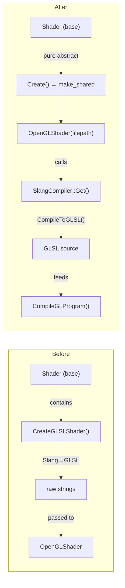

# Shader System Refactor — Change Report

**Date:** 2026-06-17  
**Status:** ✅ Build passes (Debug/x64)

---

## Overview

Refactored the Brynhild engine's shader system to move Slang compilation out of the abstract base class and into a dedicated utility, following the same abstraction pattern already established by `VertexBuffer` / `OpenGLVertexBuffer`. Also added uniform support and updated the shader + vertex data for an RGB triangle.

---

## New Files

### [SlangCompiler.h](file:///d:/BrynhildrForAI/Brynhild/Brynhild/src/Brynhild/Renderer/SlangCompiler.h)

Singleton utility class that owns the Slang `IGlobalSession`. The session is created once in the constructor and reused for all subsequent shader compilations, avoiding the per-shader session creation overhead.

```cpp
class SlangCompiler
{
public:
  static SlangCompiler& Get();
  SlangCompiledGLSL CompileToGLSL(const std::string& filepath,
    const std::string& vertexEntry = "vertexMain",
    const std::string& fragmentEntry = "fragmentMain");
private:
  Slang::ComPtr<slang::IGlobalSession> m_GlobalSession;
};
```

Entry point names are now configurable (defaulting to `"vertexMain"` / `"fragmentMain"`) rather than hardcoded.

---

### [SlangCompiler.cpp](file:///d:/BrynhildrForAI/Brynhild/Brynhild/src/Brynhild/Renderer/SlangCompiler.cpp)

Contains all Slang compilation logic previously buried in `Shader::CreateGLSLShader()`. Key improvement: **every `SlangResult` is now checked**, and every `diagnosticsBlob` is logged if non-null.

```diff
-// OLD: result captured, never checked
-SlangResult result = session->createCompositeComponentType(...);
-
+// NEW: result checked, diagnostics logged
+SlangResult result = session->createCompositeComponentType(...);
+if (diagnosticsBlob) {
+  BRYN_CORE_ERROR("Slang compose diagnostics: {0}", ...);
+}
+BRYN_CORE_ASSERT(SLANG_SUCCEEDED(result) && composedProgram, ...);
```

This pattern is applied to all four Slang operations: `loadModule`, `createCompositeComponentType`, `link`, and `getEntryPointCode`.

---

## Modified Files

### [Shader.h](file:///d:/BrynhildrForAI/Brynhild/Brynhild/src/Brynhild/Renderer/Shader.h)

The base class is now a clean abstract interface with no Slang dependency.

```diff
-#include <slang.h>
-#include <slang-com-ptr.h>
-#include <slang-com-helper.h>
+#include <string>
+#include <memory>
+#include <glm/glm.hpp>

 class Shader
 {
 public:
-  Shader();
-  virtual ~Shader() {};
+  virtual ~Shader() = default;

   virtual void Bind() = 0;
   virtual void Unbind() = 0;

-  static Shader* Create(const char* shaderName);
-private:
-  static std::pair<std::string, std::string> CreateGLSLShader(std::string shaderName);
+  // Uniform API
+  virtual void SetInt(const std::string& name, int value) = 0;
+  virtual void SetFloat(const std::string& name, float value) = 0;
+  virtual void SetVec3(const std::string& name, const glm::vec3& value) = 0;
+  virtual void SetVec4(const std::string& name, const glm::vec4& value) = 0;
+  virtual void SetMat4(const std::string& name, const glm::mat4& value) = 0;
+
+  static std::shared_ptr<Shader> Create(const std::string& filepath);
 };
```

**Changes:**
- Removed all 3 Slang includes — no longer contaminates every translation unit that includes `Shader.h`
- Removed `CreateGLSLShader()` private method
- Removed empty constructor
- Added 5 uniform setter virtual methods (`SetInt`, `SetFloat`, `SetVec3`, `SetVec4`, `SetMat4`)
- `Create()` now returns `std::shared_ptr<Shader>` (matching `VertexBuffer::Create` / `ElementBuffer::Create`) and takes `const std::string&` instead of `const char*`

---

### [Shader.cpp](file:///d:/BrynhildrForAI/Brynhild/Brynhild/src/Brynhild/Renderer/Shader.cpp)

Reduced from 126 lines to 22. The entire 100-line `CreateGLSLShader()` method is gone.

```diff
-Shader::Shader() {
-}
-Shader* Shader::Create(const char* shaderName)
+std::shared_ptr<Shader> Shader::Create(const std::string& filepath)
 {
   switch (Renderer::GetRendererAPI()) {
   case RendererAPI::API::None:
     BRYN_CORE_ERROR("No shader for API None!");
     return nullptr;
   case RendererAPI::API::OpenGL:
-    BRYN_CORE_INFO("Returning GLSL shader...");
-    auto [vertex, fragment] = CreateGLSLShader(shaderName);
-    return new OpenGLShader(vertex.c_str(), fragment.c_str());
+    return std::make_shared<OpenGLShader>(filepath);
   }
-  // ... plus ~100 lines of CreateGLSLShader deleted
 }
```

The factory is now a pure dispatcher — it creates the platform-specific subclass and nothing else.

---

### [OpenGLShader.h](file:///d:/BrynhildrForAI/Brynhild/Brynhild/src/Brynhild/Platform/OpenGL/OpenGLShader.h)

```diff
-  OpenGLShader(const char* vertexShader, const char* fragmentShader);
+  explicit OpenGLShader(const std::string& filepath);

+  void SetInt(const std::string& name, int value) override;
+  void SetFloat(const std::string& name, float value) override;
+  void SetVec3(const std::string& name, const glm::vec3& value) override;
+  void SetVec4(const std::string& name, const glm::vec4& value) override;
+  void SetMat4(const std::string& name, const glm::mat4& value) override;

+private:
+  void CompileGLProgram(const std::string& vertexSource, const std::string& fragmentSource);
+  int GetUniformLocation(const std::string& name);
```

**Changes:**
- Constructor takes a filepath — `OpenGLShader` now owns its full pipeline
- All 5 uniform setter overrides added
- `CompileGLProgram` extracts the GL compilation into a private helper
- `GetUniformLocation` centralizes uniform lookup with warning on missing uniforms

---

### [OpenGLShader.cpp](file:///d:/BrynhildrForAI/Brynhild/Brynhild/src/Brynhild/Platform/OpenGL/OpenGLShader.cpp)

**Constructor — now drives its own pipeline:**
```cpp
OpenGLShader::OpenGLShader(const std::string& filepath)
{
  auto compiled = SlangCompiler::Get().CompileToGLSL(filepath);
  CompileGLProgram(compiled.vertexSource, compiled.fragmentSource);
}
```

**Error logging — `std::cout` → `BRYN_CORE_ERROR`:**
```diff
-std::cout << "ERROR::SHADER::VERTEX::COMPILATION_FAILED\n" << infoLog << std::endl;
+BRYN_CORE_ERROR("SHADER::VERTEX::COMPILATION_FAILED: {0}", infoLog);

-std::cout << "ERROR::SHADER::FRAGMENT::COMPILATION_FAILED\n" << infoLog << std::endl;
+BRYN_CORE_ERROR("SHADER::FRAGMENT::COMPILATION_FAILED: {0}", infoLog);

-std::cout << "ERROR::SHADER::PROGRAM::LINKING_FAILED\n" << infoLog << std::endl;
+BRYN_CORE_ERROR("SHADER::PROGRAM::LINKING_FAILED: {0}", infoLog);
```

**Uniform implementations** (new):
```cpp
void OpenGLShader::SetMat4(const std::string& name, const glm::mat4& value) {
  glUniformMatrix4fv(GetUniformLocation(name), 1, GL_FALSE, glm::value_ptr(value));
}
// + SetInt, SetFloat, SetVec3, SetVec4
```

---

### [Shader.slang](file:///d:/BrynhildrForAI/Brynhild/SandBox/assets/shaders/Shader.slang)

Updated to support per-vertex color for the RGB triangle:

```diff
+struct VertexInput {
+  float3 position : POSITION;
+  float3 color    : COLOR;
+};
+
+struct VertexOutput {
+  float4 position : SV_Position;
+  float3 color    : COLOR;
+};

 [shader("vertex")]
-float4 vertexMain(float3 pos : POSITION) : SV_Position {
-  return float4(pos, 1.0);
+VertexOutput vertexMain(VertexInput input) {
+  VertexOutput output;
+  output.position = float4(input.position, 1.0);
+  output.color = input.color;
+  return output;
 }

 [shader("fragment")]
-float4 fragmentMain() : SV_Target {
-  return float4(1.0f, 0.5f, 0.2f, 1.0f);
+float4 fragmentMain(VertexOutput input) : SV_Target {
+  return float4(input.color, 1.0f);
 }
```

---

### [Source.cpp](file:///d:/BrynhildrForAI/Brynhild/SandBox/src/Source.cpp)

```diff
-float vertices[3 * 3] = {
-  -0.5f, -0.5f, 0.0f,
-   0.5f, -0.5f, 0.0f,
-   0.0f,  0.5f, 0.0f
+float vertices[] = {
+  // Position          // Color (RGB)
+  -0.5f, -0.5f, 0.0f,  1.0f, 0.0f, 0.0f,  // Bottom-left  → Red
+   0.5f, -0.5f, 0.0f,  0.0f, 1.0f, 0.0f,  // Bottom-right → Green
+   0.0f,  0.5f, 0.0f,  0.0f, 0.0f, 1.0f   // Top-center   → Blue
 };

 Brynhild::BufferLayoutList layoutList = {
   { Brynhild::ShaderDataType::Float3 , "a_Position" },
+  { Brynhild::ShaderDataType::Float3 , "a_Color" },
 };

-std::shared_ptr<Brynhild::VertexBuffer> VBO = Brynhild::VertexBuffer::Create(vertices, std::size(vertices) * sizeof(float));
+std::shared_ptr<Brynhild::VertexBuffer> VBO = Brynhild::VertexBuffer::Create(vertices, sizeof(vertices));

-m_Shader.reset(Brynhild::Shader::Create("Shader"));
+m_Shader = Brynhild::Shader::Create("assets/shaders/Shader.slang");
```

---

### [Buffer.cpp](file:///d:/BrynhildrForAI/Brynhild/Brynhild/src/Brynhild/Renderer/Buffer.cpp) — Bug Fix

```diff
-for (BufferLayoutElement el : m_LayoutElements) {
-  m_Stride += ShaderDataTypeSize(el.DataType);
+for (BufferLayoutElement& el : m_LayoutElements) {
   el.Offset = previousOffset;
+  m_Stride += ShaderDataTypeSize(el.DataType);
   previousOffset += ShaderDataTypeSize(el.DataType);
 }
```

> [!CAUTION]
> The old code iterated by **value**, so `el.Offset = previousOffset` modified a temporary copy — the actual `m_LayoutElements` vector entries kept `Offset = 0`. With a single attribute (position only), offset 0 was coincidentally correct. With interleaved position + color, the color attribute would have read from byte offset 0 instead of 12, corrupting the vertex data.

---

## Architecture — Before vs After



---

## Build Notes

- Premake project files were regenerated (`vendor\bin\premake\premake5.exe vs2022`) to include the new `SlangCompiler.cpp` in `Brynhild.vcxproj`
- Pre-existing `LNK4006` warning (`__NULL_IMPORT_DESCRIPTOR` from `slang.lib` vs `opengl32.lib`) is harmless and unchanged
- No new warnings introduced
