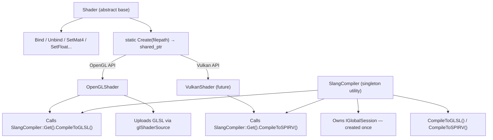

# Shader Abstraction Review — Brynhild Engine

## Summary

Using Slang as a meta-shading language that cross-compiles to GLSL (and eventually SPIR-V/HLSL) is a solid architectural choice. But the current implementation has the **Slang compilation baked into the wrong layer**, which defeats the purpose of your platform abstraction. Below is a breakdown based on the actual code.

---

## 🔴 Critical Issues

### 1. Slang compilation lives in the base `Shader` class — not in the platform layer

This is the core problem. The current architecture is:

```
Shader (base)           ← contains CreateGLSLShader() — Slang→GLSL compilation
  └── OpenGLShader      ← receives raw GLSL char* strings, just calls glShaderSource
```

[Shader.h:19](file:///d:/BrynhildrForAI/Brynhild/Brynhild/src/Brynhild/Renderer/Shader.h#L19) declares a `private` static method:
```cpp
static std::pair<std::string, std::string> CreateGLSLShader(std::string shaderName);
```

And [Shader.cpp:28-125](file:///d:/BrynhildrForAI/Brynhild/Brynhild/src/Brynhild/Renderer/Shader.cpp#L28-L125) implements it by:
- Creating a `slang::IGlobalSession` from scratch every call
- Configuring a GLSL target (`SLANG_GLSL`, `glsl_460`)
- Loading, composing, linking and extracting GLSL strings

**Why this is wrong:**
- The **base class should know nothing about GLSL**. It is supposed to be API-agnostic.
- If you add Vulkan support, you need `SLANG_SPIRV` — but the compilation logic is locked inside the base class targeting GLSL specifically.
- [Shader.h:3-5](file:///d:/BrynhildrForAI/Brynhild/Brynhild/src/Brynhild/Renderer/Shader.h#L3-L5) pulls in `<slang.h>`, `<slang-com-ptr.h>`, and `<slang-com-helper.h>` — meaning **every translation unit that includes `Shader.h` (including `Renderer.h`) also pulls in the entire Slang API**, even on platforms that will never use it.

### 2. `Shader::Create()` does the compilation itself instead of delegating

[Shader.cpp:12-26](file:///d:/BrynhildrForAI/Brynhild/Brynhild/src/Brynhild/Renderer/Shader.cpp#L12-L26):

```cpp
case RendererAPI::API::OpenGL:
    BRYN_CORE_INFO("Returning GLSL shader...");
    auto [vertex, fragment] = CreateGLSLShader(shaderName);
    return new OpenGLShader(vertex.c_str(), fragment.c_str());
```

The factory is doing Slang→GLSL compilation, then passing raw `const char*` strings to `OpenGLShader`. This means `OpenGLShader` is just a "raw GLSL string uploader" with no knowledge of where its source came from. A future `VulkanShader` would have no hook to ask for SPIR-V instead.

### 3. `Shader::Create()` returns a raw pointer — inconsistent with the rest of the engine

[Shader.h:17](file:///d:/BrynhildrForAI/Brynhild/Brynhild/src/Brynhild/Renderer/Shader.h#L17):
```cpp
static Shader* Create(const char* shaderName);
```

Compare with `VertexBuffer::Create`, `ElementBuffer::Create` in [Buffer.h:105,120](file:///d:/BrynhildrForAI/Brynhild/Brynhild/src/Brynhild/Renderer/Buffer.h#L105-L120) — both return `std::shared_ptr`. 

The caller in [Source.cpp:40](file:///d:/BrynhildrForAI/Brynhild/SandBox/src/Source.cpp#L40) works around this with:
```cpp
m_Shader.reset(Brynhild::Shader::Create("Shader"));
```
...while `m_Shader` is declared as `std::shared_ptr<Brynhild::Shader>` at [Source.cpp:62](file:///d:/BrynhildrForAI/Brynhild/SandBox/src/Source.cpp#L62). This is an inconsistency that will bite you. Note also that `VertexArray::Create()` in [Buffer.cpp:52-65](file:///d:/BrynhildrForAI/Brynhild/Brynhild/src/Brynhild/Renderer/Buffer.cpp#L52-L65) also returns a raw `VertexArray*`, so this raw-pointer inconsistency extends beyond shaders.

### 4. Slang `IGlobalSession` is created and destroyed on every shader load

[Shader.cpp:30-31](file:///d:/BrynhildrForAI/Brynhild/Brynhild/src/Brynhild/Renderer/Shader.cpp#L30-L31):
```cpp
Slang::ComPtr<slang::IGlobalSession> globalSession;
createGlobalSession(globalSession.writeRef());
```

Every call to `CreateGLSLShader()` creates a brand new global session. This is expensive — global session creation involves loading the Slang standard library. It should be created once and reused for the lifetime of the renderer.

---

## 🟡 Moderate Issues

### 5. No `SlangResult` error checking on composition, linking, or code extraction

[Shader.cpp:86-118](file:///d:/BrynhildrForAI/Brynhild/Brynhild/src/Brynhild/Renderer/Shader.cpp#L86-L118):

```cpp
SlangResult result = session->createCompositeComponentType(...);
// result never checked

SlangResult result = composedProgram->link(...);
// result never checked

SlangResult result = linkedProgram->getEntryPointCode(0, ...);
// result never checked
result = linkedProgram->getEntryPointCode(1, ...);
// result never checked
```

If any of these fail, `VertexCodeBlob` or `FragmentCodeBlob` will be null. The code then blindly dereferences them at [Shader.cpp:121-122](file:///d:/BrynhildrForAI/Brynhild/Brynhild/src/Brynhild/Renderer/Shader.cpp#L121-L122):
```cpp
std::string vertexShaderSourceGLSL = static_cast<const char*>(VertexCodeBlob->getBufferPointer());
std::string fragmentShaderSourceGLSL = static_cast<const char*>(FragmentCodeBlob->getBufferPointer());
```
This is a guaranteed null dereference crash path if Slang compilation fails silently.

### 6. No uniform/parameter API

[Shader.h](file:///d:/BrynhildrForAI/Brynhild/Brynhild/src/Brynhild/Renderer/Shader.h) only exposes `Bind()` and `Unbind()`. There is no way to set uniforms. The consequence is already visible: in [Renderer.cpp:19](file:///d:/BrynhildrForAI/Brynhild/Brynhild/src/Brynhild/Renderer/Renderer.cpp#L19), the projection-view matrix upload is commented out:

```cpp
//shader->SetMat4("u_ProjectionView", s_SceneData->ProjectionView);
```

The `SceneData` struct and `Camera` integration are already in place — the only thing missing is the `SetMat4` virtual method on `Shader` and its implementation in `OpenGLShader` (via `glUniformMatrix4fv`).

### 7. `OpenGLShader` uses `std::cout` instead of the engine logging system

[OpenGLShader.cpp:18,29,40](file:///d:/BrynhildrForAI/Brynhild/Brynhild/src/Brynhild/Platform/OpenGL/OpenGLShader.cpp#L17-L40):
```cpp
std::cout << "ERROR::SHADER::VERTEX::COMPILATION_FAILED\n" << infoLog << std::endl;
std::cout << "ERROR::SHADER::FRAGMENT::COMPILATION_FAILED\n" << infoLog << std::endl;
std::cout << "ERROR::SHADER::PROGRAM::LINKING_FAILED\n" << infoLog << std::endl;
```
You have `BRYN_CORE_ERROR` — use it consistently everywhere.

### 8. Entry point names are hardcoded strings

[Shader.cpp:65,72](file:///d:/BrynhildrForAI/Brynhild/Brynhild/src/Brynhild/Renderer/Shader.cpp#L65-L72):
```cpp
slangModule->findEntryPointByName("vertexMain", VertexEntryPoint.writeRef());
slangModule->findEntryPointByName("fragmentMain", FragmentEntryPoint.writeRef());
```
This prevents compute shaders, geometry shaders, or any shader that uses different entry point names. Entry point names should be configurable or discovered via Slang's reflection API.

### 9. `diagnosticsBlob` declared but unused in entry point lookups

[Shader.cpp:64,71](file:///d:/BrynhildrForAI/Brynhild/Brynhild/src/Brynhild/Renderer/Shader.cpp#L64-L71):
```cpp
Slang::ComPtr<slang::IBlob> diagnosticsBlob;  // declared, never used
slangModule->findEntryPointByName("vertexMain", VertexEntryPoint.writeRef());
```
`findEntryPointByName` doesn't take a diagnostics parameter, so the blob is just dead code. The module-load case at line 55 does check diagnostics correctly — make the entry point lookups consistent in style.

---

## 🟢 Minor / Style Issues

### 10. Shader asset path is hardcoded and fragile

[Shader.cpp:50](file:///d:/BrynhildrForAI/Brynhild/Brynhild/src/Brynhild/Renderer/Shader.cpp#L50):
```cpp
std::string shaderPath = "assets/shaders/" + shaderName + ".slang";
```
This is a relative path that depends on the working directory being the SandBox project root at runtime. It breaks if you run the executable from anywhere else, or from a test harness. The path root should come from the application configuration or be passed in by the caller.

### 11. `Shader::Create()` takes `const char*` while `CreateGLSLShader` takes `std::string`

[Shader.h:17](file:///d:/BrynhildrForAI/Brynhild/Brynhild/src/Brynhild/Renderer/Shader.h#L17) — `Create(const char* shaderName)`, then internally [Shader.cpp:20](file:///d:/BrynhildrForAI/Brynhild/Brynhild/src/Brynhild/Renderer/Shader.cpp#L20) calls `CreateGLSLShader(shaderName)` which takes `std::string`. Pick one and be consistent — `std::string_view` or `const std::string&` at the public API is better than a raw `const char*`.

### 12. `Shader` constructor is empty and unnecessary

[Shader.cpp:10-11](file:///d:/BrynhildrForAI/Brynhild/Brynhild/src/Brynhild/Renderer/Shader.cpp#L10-L11):
```cpp
Shader::Shader() {
}
```
[Shader.h:11](file:///d:/BrynhildrForAI/Brynhild/Brynhild/src/Brynhild/Renderer/Shader.h#L11) declares it as `Shader()`. Since the base class has no members to initialize and the class is abstract, the default constructor should be `= default` or simply removed.

### 13. PascalCase local variables in `CreateGLSLShader`

[Shader.cpp:62,69,76,83,93,101,102](file:///d:/BrynhildrForAI/Brynhild/Brynhild/src/Brynhild/Renderer/Shader.cpp):
```cpp
Slang::ComPtr<slang::IEntryPoint> VertexEntryPoint;
Slang::ComPtr<slang::IEntryPoint> FragmentEntryPoint;
Slang::ComPtr<slang::IComponentType> composedProgram;  // camelCase
Slang::ComPtr<slang::IComponentType> linkedProgram;    // camelCase
Slang::ComPtr<slang::IBlob> VertexCodeBlob;            // PascalCase again
```
Mixed casing conventions within the same function. Pick one (camelCase for locals is the C++ norm).

### 14. `ShaderDataType` is declared in `Buffer.h` with a comment acknowledging it is in the wrong place

[Buffer.h:4-5](file:///d:/BrynhildrForAI/Brynhild/Brynhild/src/Brynhild/Renderer/Buffer.h#L4-L5):
```cpp
//Should be later moved to respective Shader file
//-----------------------------------------------
enum class ShaderDataType { ... };
```
This is a self-noted TODO. Once `Shader.h` is cleaned up and no longer has Slang includes, it's the right place for `ShaderDataType`.

---

## Proposed Redesign

The key insight: **Slang compilation is a _shader compiler_ concern, not a shader object concern.** The platform-specific subclass should handle both compilation (via Slang) and GPU program creation (via OpenGL/Vulkan/etc).

### Architecture



### Concrete Changes

#### `Shader.h` — Clean abstract interface (no Slang dependency)

```cpp
#pragma once
#include <string>
#include <memory>
#include <glm/glm.hpp>

namespace Brynhild {
  class Shader
  {
  public:
    virtual ~Shader() = default;

    virtual void Bind() = 0;
    virtual void Unbind() = 0;

    // Uniform API
    virtual void SetInt(const std::string& name, int value) = 0;
    virtual void SetFloat(const std::string& name, float value) = 0;
    virtual void SetVec3(const std::string& name, const glm::vec3& value) = 0;
    virtual void SetVec4(const std::string& name, const glm::vec4& value) = 0;
    virtual void SetMat4(const std::string& name, const glm::mat4& value) = 0;

    static std::shared_ptr<Shader> Create(const std::string& filepath);
  };
}
```

> [!IMPORTANT]
> No Slang headers, no `CreateGLSLShader`, no GLSL-specific logic. The base class is purely abstract. `ShaderDataType` can also move here from `Buffer.h`.

#### `SlangCompiler.h/.cpp` — Dedicated compilation utility (new files)

```cpp
// SlangCompiler.h
#pragma once
#include <string>
#include <slang.h>
#include <slang-com-ptr.h>
#include <slang-com-helper.h>

namespace Brynhild {

  struct SlangCompiledGLSL {
    std::string vertexSource;
    std::string fragmentSource;
  };

  class SlangCompiler
  {
  public:
    static SlangCompiler& Get();  // Singleton — owns the global session

    SlangCompiledGLSL CompileToGLSL(const std::string& filepath);
    // Future: std::vector<uint32_t> CompileToSPIRV(const std::string& filepath);

  private:
    SlangCompiler();
    ~SlangCompiler() = default;

    Slang::ComPtr<slang::IGlobalSession> m_GlobalSession;
  };
}
```

The singleton's constructor calls `createGlobalSession` once. All subsequent shader loads reuse `m_GlobalSession`.

#### `OpenGLShader` — Now owns its full pipeline

```cpp
// OpenGLShader.h
class OpenGLShader : public Shader
{
public:
  explicit OpenGLShader(const std::string& filepath);
  ~OpenGLShader();

  void Bind() override;
  void Unbind() override;

  void SetInt(const std::string& name, int value) override;
  void SetFloat(const std::string& name, float value) override;
  void SetVec3(const std::string& name, const glm::vec3& value) override;
  void SetVec4(const std::string& name, const glm::vec4& value) override;
  void SetMat4(const std::string& name, const glm::mat4& value) override;

private:
  void CompileGLProgram(const std::string& vertSrc, const std::string& fragSrc);
  unsigned int m_ID;
};
```

```cpp
// OpenGLShader.cpp
OpenGLShader::OpenGLShader(const std::string& filepath)
{
  auto compiled = SlangCompiler::Get().CompileToGLSL(filepath);
  CompileGLProgram(compiled.vertexSource, compiled.fragmentSource);
}
```

`OpenGLShader` now knows it needs GLSL and asks for it. A `VulkanShader` asks for SPIR-V instead. Neither bleeds into the base class.

#### `Shader::Create()` — Simple factory, no compilation

```cpp
std::shared_ptr<Shader> Shader::Create(const std::string& filepath)
{
  switch (Renderer::GetRendererAPI()) {
  case RendererAPI::API::None:
    BRYN_CORE_ERROR("No shader for API None!");
    return nullptr;
  case RendererAPI::API::OpenGL:
    return std::make_shared<OpenGLShader>(filepath);
  }
  BRYN_CORE_ASSERT(false, "Unknown RendererAPI!");
  return nullptr;
}
```

#### `Source.cpp` — Clean up the call site

```cpp
// Before
m_Shader.reset(Brynhild::Shader::Create("Shader"));

// After
m_Shader = Brynhild::Shader::Create("assets/shaders/Shader.slang");
```

The full path is passed by the caller — not constructed inside the compiler. The caller knows the asset layout; the compiler shouldn't.

---

## Summary of What to Change

| File | Action |
|------|--------|
| [Shader.h](file:///d:/BrynhildrForAI/Brynhild/Brynhild/src/Brynhild/Renderer/Shader.h) | Remove all 3 Slang includes; remove `CreateGLSLShader`; add uniform virtual methods; change `Create` to return `shared_ptr<Shader>` and take `const std::string&` |
| [Shader.cpp](file:///d:/BrynhildrForAI/Brynhild/Brynhild/src/Brynhild/Renderer/Shader.cpp) | Delete `CreateGLSLShader` entirely (~100 lines); simplify `Create` to `make_shared<OpenGLShader>(filepath)`; remove Slang includes |
| **[NEW] SlangCompiler.h/.cpp** | All Slang compilation logic lives here; singleton owns `IGlobalSession`; checks all `SlangResult` return values; exposed as `CompileToGLSL(filepath)` |
| [OpenGLShader.h](file:///d:/BrynhildrForAI/Brynhild/Brynhild/src/Brynhild/Platform/OpenGL/OpenGLShader.h) | Change constructor to take `const std::string& filepath`; add uniform setter overrides |
| [OpenGLShader.cpp](file:///d:/BrynhildrForAI/Brynhild/Brynhild/src/Brynhild/Platform/OpenGL/OpenGLShader.cpp) | Call `SlangCompiler::Get().CompileToGLSL(filepath)`; replace all 3 `std::cout` errors with `BRYN_CORE_ERROR`; implement `SetMat4` etc. via `glUniformMatrix4fv` |
| [Buffer.h](file:///d:/BrynhildrForAI/Brynhild/Brynhild/src/Brynhild/Renderer/Buffer.h) | Move `ShaderDataType` enum and helpers to `Shader.h` (self-noted TODO at line 4) |
| [Source.cpp](file:///d:/BrynhildrForAI/Brynhild/SandBox/src/Source.cpp) | Replace `m_Shader.reset(Shader::Create("Shader"))` with `m_Shader = Shader::Create("assets/shaders/Shader.slang")` |

---

> [!TIP]
> The pattern you should follow is the one already established with `VertexBuffer` / `OpenGLVertexBuffer` (see [Buffer.h](file:///d:/BrynhildrForAI/Brynhild/Brynhild/src/Brynhild/Renderer/Buffer.h#L94-L106) and [Buffer.cpp](file:///d:/BrynhildrForAI/Brynhild/Brynhild/src/Brynhild/Renderer/Buffer.cpp#L9-L22)): the abstract base defines the interface, the factory dispatches by API via `make_shared`, and the OpenGL subclass does all the OpenGL work. The only addition for shaders is the `SlangCompiler` singleton that the OpenGL (and future Vulkan) subclass calls before doing GPU work.

> [!NOTE]
> `VertexArray::Create()` in [Buffer.cpp:52-65](file:///d:/BrynhildrForAI/Brynhild/Brynhild/src/Brynhild/Renderer/Buffer.cpp#L52-L65) still returns a raw `VertexArray*` (same inconsistency as `Shader::Create`). Consider fixing both at the same time.
